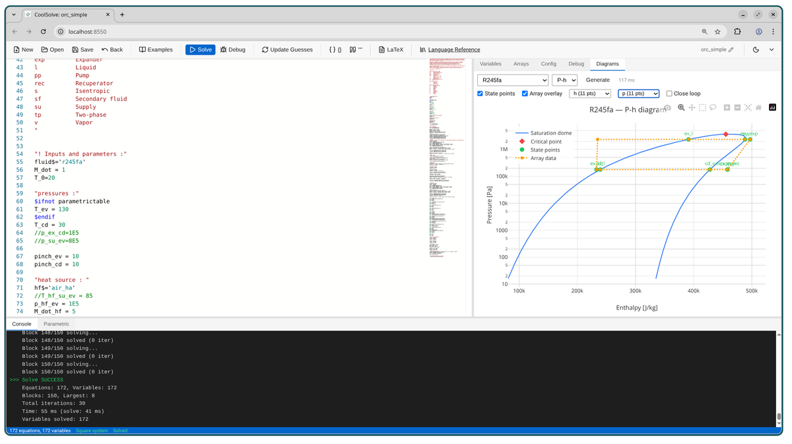

<p align="center">
  
</p>

# CoolSolve

CoolSolve is a parser, structural analyzer, and equation solver using a language compatible with EES (Engineering Equation Solver), designed as an open-source alternative that integrates with CoolProp for thermodynamic property calculations.



## Try CoolSolve

### Windows Desktop Application (v0.2)

Download the Windows installer: **[CoolSolve v0.2 for Windows](https://dox.uliege.be/index.php/s/xCcllAEs4Y8hsnx/download)**

See [Version History](docs/versions.md) for all releases, changelogs, and
the CoolProp version bundled in each release.

### Online Demo

Try CoolSolve in your browser: **[https://coolsolve.squoilin.eu/](https://coolsolve.squoilin.eu/)**

> **⚠ Disclaimer**: The online demo runs on a private server and corresponds to the latest development version, which may not always be stable. Under high load, the server may respond slowly or be temporarily unavailable.

## Features

- **Parser**: Parses CoolSolve source code (.eescode files) into an Abstract Syntax Tree
  - Variables (scalars and arrays like `P[1]`)
  - Equations with operators (`+`, `-`, `*`, `/`, `^`)
  - Comparison operators (`<`, `>`, `<=`, `>=`)
  - **Procedural Statements**: Support for `=` and `:=` in procedural blocks
  - **Functions and Procedures**: `FUNCTION` and `PROCEDURE` blocks with local scoping
  - **Procedure Calls**: `CALL name(inputs : outputs)` syntax
  - **Conditional Logic**: `IF-THEN-ELSE` support within procedural blocks
  - **Inline IF**: `IF(condition, true_value, false_value)` expression-level conditional
  - **DUPLICATE loops**: `DUPLICATE i=1,N ... END` for array iteration in procedural blocks
  - **REPEAT-UNTIL loops**: `REPEAT ... UNTIL(condition)` for iterative procedural logic
  - Comments (`"..."`, `{...}`, `//...`)
  - Directives (`$ifnot`, `$endif`, etc.)
  - Units annotations (`"[Pa]"`, `"[kJ/kg]"`)
  - Function calls with named arguments (`enthalpy(R134a, T=300, P=1E5)`)

- **Structural Analysis**: Decomposes the equation system into solvable blocks
  - Hopcroft-Karp algorithm for variable-equation matching
  - Tarjan's algorithm for Strongly Connected Components (SCCs)
  - Block decomposition (identifies algebraic loops)

- **Automatic Differentiation**: Forward-mode AD for efficient Jacobian computation
  - Full support for arithmetic operators (`+`, `-`, `*`, `/`, `^`)
  - Transcendental functions (`sin`, `cos`, `exp`, `log`, `sqrt`, etc.)
  - Inverse hyperbolic functions (`arcsinh`, `arccosh`, `arctanh`)
  - Rounding functions (`ceil`, `floor`, `round`, `trunc`, `sign`, `mod`)
  - Aggregation functions (`sum`, `average`, `product`, `stddev`)
  - Unit conversion functions (`convert`, `converttemp`)
  - Exact analytical derivatives (no finite differences)
  - Prepares for Newton-based numerical solvers

- **Equation Evaluator**: Evaluates residuals and Jacobians for each block
  - Block-level evaluation with external variable support
  - System-level orchestration for sequential block solving
  - **CoolProp integration** for thermodynamic property calculations via the low-level `AbstractState` API (with thread-local caching and `PropsSI` fallback)
  - **Analytical derivatives** from CoolProp's `first_partial_deriv()` with automatic forward-FD consistency check (falls back to FD near phase boundaries)
  - **Residual-only evaluation mode**: skips Jacobian computation during line search backtracking
  - Automatic temperature conversion (Celsius ↔ Kelvin)
  - **Configurable Solver Pipeline** with multiple algorithms and execution modes
  - **Explicit solve for size-1 blocks**: Bypasses Newton entirely for structurally explicit assignments (one residual evaluation, no Jacobian)
  - **Newton1D root-finder** for size-1 implicit blocks with multi-probe exploration and bisection fallback
  - **Newton + Line Search** for fast convergence on well-conditioned blocks
  - **Trust-Region Dogleg** for robust convergence on stiff nonlinear blocks
  - **Levenberg-Marquardt** for improved convergence when initial guesses are poor
  - **Multi-dimensional Bisection (BisectionND)** for small blocks (configurable size limit, default n ≤ 8 via `bisectionNDMaxBlockSize`): derivative-free sign-change bisection that works even when the Jacobian is singular or zero
   - **Homotopy continuation** for convergence from distant or difficult starting points where gradient methods fail
   - **Partitioned Block Updates** as a fallback for ill-conditioned algebraic loops
   - **Multi-Start fallback** (roadmap §4.2): when a multi-variable block fails the entire pipeline, CoolSolve retries it from a few alternative starting points — CoolProp-consistent pressure regimes for thermo blocks, scale factors for purely-algebraic blocks. Candidates can run concurrently (`multiStartNumCores`). Zero overhead when every block converges on the first try.
  - **Symbolic Block Reduction**: optional pre-processing that shrinks blocks via explicit extraction, CoolProp call inversion, and equation substitution — with automatic re-decomposition of the reduced block into independent sub-blocks
  - **Parallel solver execution** (multithreaded, first-to-converge wins)

- **Output Formats**:
  - JSON (for automated testing and integration)
  - LaTeX equations
  - Evaluator report (block summary and state)
  - **Solution/Initials files**: Support for loading initial values and comparing solutions

- **Solution Verification**: After a successful solve, CoolSolve independently re-evaluates every equation (including procedure CALLs) using the proposed solution and checks that LHS ≈ RHS within a configurable tolerance (default: 0.1%). This catches structural bugs, numerical drift, and procedure output inconsistencies that the solver's own convergence check may miss. Enabled automatically in debug mode (`-d`) and in the comprehensive test suite.

- **Lookup Tables**: External CSV data files are loaded automatically and callable from equations via built-in interpolation and lookup functions. Companion CSVs follow the naming convention **`<modelname>-<tablename>.csv`** (e.g. `mymodel-data.csv` is callable as `LOOKUP('data', …)`). See [Language Reference §11](docs/language_reference.md#11-lookup-tables) for full details.
  - `INTERPOLATE('table', 'xcol', 'ycol', x)` — 1D linear interpolation with analytical AD gradient
  - `INTERPOLATE2('table', 'xcol', 'ycol', 'zcol', x, y)` — 2D bilinear interpolation with AD partial derivatives
  - `LOOKUP('table', row, col)` / `TABLEVALUE(...)` — direct cell access
  - `NLOOKUPROWS`, `NLOOKUPCOLUMNS`, `LOOKUPCOL`, `LOOKUPCELLEMPTY` — table metadata
  - `SUMLOOKUP`, `AVGLOOKUP`, `MAXLOOKUP`, `MINLOOKUP`, `STDDEVLOOKUP` — column aggregates
  - GUI **Lookup Tables** panel: create, view, and edit tables in-browser without managing CSV files manually

- **Debug Mode**: Creates a comprehensive output folder with all analysis information

## Documentation

| Document | Description |
|----------|-------------|
| [Language Reference](docs/language_reference.md) | CoolSolve language syntax and built-in functions |
| [Debugging Models](docs/debugging_models.md) | Diagnosing and fixing solver failures |
| [Solver Roadmap](docs/solver_roadmap.md) | Performance roadmap and future architecture |
| [Symbolic Block Reduction](docs/symbolic_redecomposition.md) | Symbolic block reduction algorithm |
| [GUI & REST API](docs/gui.md) | Web interface, REST API, and parametric studies |
| [Deployment Guide](docs/deployment_ubuntu_apache.md) | Deploying CoolSolve on Ubuntu with Apache |
| [Contributing Guide](docs/contributing.md) | Workflow and integration checklist for new features and bug fixes |
| [Version History](docs/versions.md) | Release notes, download links, and CoolProp version per release |

## Performance and Roadmap

For details on current performance optimizations and the future roadmap for solver integration, see the [Solver Roadmap](docs/solver_roadmap.md).

## File Formats

CoolSolve uses several file formats for input and verification:

- **.eescode**: The EES source code to be parsed and solved.
- **.initials**: Initial values for variables, used to seed the solver or evaluator. Format: `variable=value` (one per line).
- **coolsolve.conf**: Optional solver configuration. Place in the **same folder** as your .eescode file (not in subfolders). Format: `key = value` per line; lines starting with `#` are comments. Only the options you set override the defaults (see `include/coolsolve/solver.h` for `SolverOptions`). An example with all keys and comments is in `examples/coolsolve.conf`. In debug mode (`-d`), this file is copied into the debug folder. Key options:
  - **Pipeline options**:
    - `solverPipeline`: Comma-separated list of solvers to try (e.g. `Newton, LM, TrustRegion, BisectionND, Homotopy, Partitioned`). Available solvers: `Newton`, `TrustRegion`, `LM` (or `LevenbergMarquardt`), `BisectionND`, `Homotopy`, `Partitioned`.
    - `pipelineMode`: `sequential` (default) or `parallel` (first-to-converge wins)
    - `enableTearing`: When `true`, use structural tearing for blocks of size ≥ `tearingMinBlockSize`.
    - `enableSymbolicReduction`: When `true`, pre-process blocks to reduce their size via explicit extraction, CoolProp call inversion, and equation substitution, with automatic re-decomposition of the reduced block.
    - `bisectionNDMaxBlockSize`: Maximum block size for BisectionND (default: `8`).
    - `bisectionNDIterFactor`: Multiplier for BisectionND iteration budget (default: `1.0`).
    - `lsNonMonotoneMemory`: Number of recent merit values kept for non-monotone acceptance (default: `10`). Set to `1` for classic monotone line search.
    - `multiStartEnabled`: When `true` (default), retry a failed multi-variable block from alternative starting points derived from each variable's inferred physical kind.
    - `multiStartMaxRestarts`: Number of alternative starting points to try on a failed block (default: `4`).
    - `multiStartNumCores`: Threads for concurrent multi-start candidates (default: `1` = sequential; `N`>1 or `0`=auto runs candidates in parallel, first-to-converge wins).
  - **CoolProp Integration options**:
    - `coolpropBackend`: CoolProp backend string (default: `HEOS`). Options: `HEOS`, `INCOMP`, `TTSE&HEOS`, `BICUBIC&HEOS`.
    - `coolpropUseAbstractState`: Use the low-level `AbstractState` API instead of `PropsSI` (default: `true`). Provides 2–5× speedup by caching fluid objects and avoiding string parsing.
    - `coolpropEnableAnalyticalDerivatives`: Use `first_partial_deriv()` for exact gradients with a forward-FD consistency check (default: `true`). Falls back to finite differences near phase boundaries where analytical derivatives are inaccurate.
    - `coolpropCacheEnabled`: Enable thread-local `AbstractState` caching (default: `true`).
    - `coolpropEnableSuperancillaries`: Enable CoolProp superancillary equations (default: `true`).

## Building

### Prerequisites

- C++17 compatible compiler (GCC 7+, Clang 5+, or MSVC 2019+)
- CMake 3.14 or later
- Git (for fetching dependencies)
- Python 3 (required by CoolProp's CMake scripts at configure time)
- Node.js 18+ and npm (required to build the React GUI frontend)

### How Dependencies Are Handled

CoolSolve is a **standalone library** that automatically downloads all its dependencies using CMake's FetchContent mechanism:

| Dependency | Purpose |
|------------|---------|
| **CoolProp** | Thermodynamic property calculations |
| **cpp-peglib** | PEG parser generator |
| **nlohmann/json** | JSON serialization |
| **Eigen** | Linear algebra |
| **Catch2** | Unit testing |

Dependencies are cached in `.fetchcontent_cache/` at the project root. This cache **persists across build folder deletions**, so you won't need to re-download dependencies if you clean and rebuild. The first `cmake` run will take several minutes to fetch CoolProp and its submodules; subsequent runs take only a few seconds.

### Build Steps

```bash
mkdir build && cd build
cmake ..
make -j$(nproc)
```

This will build:
- `coolsolve` - The main executable
- `coolsolve_tests` - The test suite

### Building on Windows

#### Prerequisites
- **[Visual Studio 2022](https://visualstudio.microsoft.com/)** with the **"Desktop development with C++"** workload (includes MSVC, CMake, and Windows SDK)
- **[Python 3](https://www.python.org/downloads/)** (or Anaconda) — required by CoolProp's CMake scripts; must be on `PATH`
- **[Node.js](https://nodejs.org/)** (v18+) — required to build the embedded React GUI
- **[NSIS](https://nsis.sourceforge.net/Download)** — to generate the single-file installer (optional, installer only)

#### Building the GUI frontend
The React frontend must be built before CMake can embed it into the binary:
```bat
cd gui
npm ci
npm run build
cd ..
```
This produces `gui/dist/` which CMake will embed into the `.exe`.

#### CMake build (Developer PowerShell for VS 2022)
```bat
mkdir build
cd build
cmake .. -G "Visual Studio 17 2022" -A x64 -DCOOLSOLVE_BUILD_GUI=ON -DCOOLSOLVE_BUILD_TESTS=OFF
cmake --build . --config Release --target coolsolve
```

The compiled binary is at `build\Release\coolsolve.exe` and is fully self-contained (no external runtime or DLLs needed).

#### Generating the installer
After a successful build:
```bat
makensis coolsolve.nsi
```
This produces `CoolSolve_Installer.exe`, a single-file installer that:
- Installs to `Program Files\CoolSolve`
- Adds a Start Menu shortcut
- Associates `.eescode` files with CoolSolve (double-click to open)
- Includes an uninstaller

#### One-click build script
A convenience script `build_installer.bat` in the project root automates all steps above. Edit the paths at the top of the file if your Visual Studio, Anaconda, or NSIS installations are in non-default locations, then right-click → **Run as Administrator**.

### Build Type: Release vs Debug

**Important**: CoolSolve defaults to **Release** mode for optimal performance. CoolProp property calculations are computationally intensive, and Debug mode can be **10-50x slower** than Release. **Do not switch to Debug** for routine work, benchmarks, or robustness reports — only when you genuinely need a debugger on the C++ code. **When you are done debugging, always switch back to Release and rebuild:**

```bash
cmake -DCMAKE_BUILD_TYPE=Release ..
cmake --build . -j$(nproc)    # or: make -j$(nproc)
```

```bash
# Default: Release mode (recommended)
cmake ..

# Explicitly set Release mode
cmake -DCMAKE_BUILD_TYPE=Release ..

# Debug mode (C++ debugger only — revert to Release afterwards!)
cmake -DCMAKE_BUILD_TYPE=Debug ..
```

If you experience slow solve times, verify you're building in Release mode:
```bash
# Check current build type (must show Release)
grep CMAKE_BUILD_TYPE CMakeCache.txt
```

### Updating CoolProp Version

By default, CoolSolve fetches the latest `master` branch of CoolProp. To use a specific version:

```bash
# Use a specific tag or commit
cmake -DCOOLSOLVE_COOLPROP_TAG=v6.6.0 ..

# Or a specific commit hash
cmake -DCOOLSOLVE_COOLPROP_TAG=abc123def ..
```

### Cleaning the Build

```bash
# Clean build artifacts only (keeps dependency cache)
rm -rf build && mkdir build && cd build && cmake .. && make -j$(nproc)

# Full clean including dependency cache (will re-download everything)
rm -rf build .fetchcontent_cache
```

## Usage

### Basic Usage

```bash
# Parse a .eescode file and output JSON analysis
./coolsolve input.eescode

# Output LaTeX equations
./coolsolve -f latex input.eescode

# Save output to a file
./coolsolve -o output.json input.eescode
```

### Debug Mode

Debug mode creates a folder containing all analysis information, useful for understanding the equation structure and debugging. For a complete guide on diagnosing and fixing solver failures (including the simplified-model workflow), see [Debugging Models](docs/debugging_models.md).

```bash
# Create debug output in <input>_coolsolve/ folder
./coolsolve -d input.eescode

# Specify custom debug output directory
./coolsolve -d my_debug_folder input.eescode
```

The debug folder contains:
| File | Description |
|------|-------------|
| `README.md` | Index of all generated files |
| `coolsolve.conf` | Copy of solver config from source folder (if present) |
| `report.md` | Model statistics and block summary |
| `variables.md` | Variable mapping table (Markdown) |
| `variables.csv` | Variable mapping (CSV for external tools) |
| `equations.md` | Equations grouped by solution block |
| `analysis.json` | Full JSON analysis data |
| `residuals.txt` | CoolSolve residuals report |
| `equations.tex` | LaTeX formatted equations |
| `incidence.md` | Variable-equation incidence matrix |
| `evaluator.md` | Evaluator structure and block evaluation tests |
| `symbolic_reduction.md` | Symbolic reduction debug report (when `enableSymbolicReduction` is on) |
| `solution_check.md` | Post-solve equation verification (LHS vs RHS for every equation) |
| `original.eescode` | Copy of the original input |

### Command Line Options

| Option | Description |
|--------|--------------|
| `-o, --output <file>` | Output file (default: stdout) |
| `-f, --format <fmt>` | Output format: `json`, `latex` (default: json) |
| `-d, --debug [dir]` | Create debug output folder |
| `-g, --guess` | Update .initials file with solution on success |
| `--no-sol` | Disable generation of .sol file |
| `--no-superancillary` | Disable CoolProp superancillary functions (faster VLE solving) |
| `-h, --help` | Show help message |

### Performance Options

#### Superancillary Functions

CoolProp's superancillary functions provide high-accuracy VLE (vapor-liquid equilibrium) calculations, especially near the critical point. However, they add computational overhead during solving.

```bash
# Default: superancillaries enabled 
./coolsolve model.eescode

# superancillaries disabled
./coolsolve --no-superancillary model.eescode

# Alternative: use environment variable
COOLPROP_ENABLE_SUPERANCILLARIES=false ./coolsolve model.eescode
```

## Running Tests

```bash
cd build

# Run all unit tests (parser, evaluator, Newton, tearing, config, etc.)
./coolsolve_tests

# Run comprehensive example file tests (solves all 40 .eescode examples,
# checks expected values, and runs solution verification on each)
./coolsolve_tests "[examples-comprehensive]"

# Run solver robustness tests (stress-tests every example with multiple
# solver configurations: Newton-only, LM-only, tearing, symbolic reduction, etc.)
# Requires a Release build — Debug timings are ~10x slower and must not be committed as reports.
./coolsolve_tests "[solver-robustness]"
```

Or using CTest:
```bash
cd build
ctest --output-on-failure
```

The comprehensive test runs all `.eescode` files in the `examples/` folder, validates solutions against known expected values (with 1% tolerance), and performs **solution verification** — independently re-evaluating every equation to confirm LHS ≈ RHS. A detailed report is written to `examples/test_examples.md`.

The robustness test runs every solvable example under multiple solver configurations and reports a summary table of successes, failures, and iteration counts per configuration. A detailed report is written to `examples/solver_robustness_report.md`.

## GUI (Web Interface)

The CoolSolve GUI is a React/TypeScript single-page app served by an embedded HTTP server inside the `coolsolve` binary. The GUI is **optional**; the CLI continues to work as described above.

### GUI Prerequisites

- **Node.js + npm**: Required only to build or develop the frontend (no Node.js is needed at runtime once the binary is built).

### Run the GUI in development mode (hot reload)

Use this when working on the GUI itself:

```bash
# Terminal 1: build and run the backend with the embedded HTTP server
mkdir -p build
cd build
cmake -DCOOLSOLVE_BUILD_GUI=ON ..
make -j$(nproc) coolsolve
./coolsolve --gui --no-browser

# Terminal 2: run the frontend dev server with hot reload
cd gui
npm install
npm run dev
# Then open http://localhost:5173 in your browser
```

In this mode, Vite serves the frontend on port `5173` and proxies API calls to the CoolSolve server (default port `8550`).

### Run the GUI from the compiled binary (no dev server)

To use the GUI as an integrated part of the `coolsolve` binary (no Node.js or Vite needed at runtime):

```bash
# 1) Build the frontend once
cd gui
npm install
npm run build        # produces gui/dist/

# 2) Build or rebuild the backend so it embeds gui/dist/ into the binary
cd ../build
cmake -DCOOLSOLVE_BUILD_GUI=ON ..
make -j$(nproc) coolsolve

# 3) Run the GUI
./coolsolve --gui     # opens the default browser, serving on http://localhost:8550
```

For more detailed information on the GUI architecture and advanced workflows (ZIP bundles, online deployment, thermodynamic diagrams, etc.), see `docs/gui.md`.

## Project Structure

```
CoolSolve/
├── CMakeLists.txt              # Build configuration (handles all dependencies)
├── README.md                   # This file
├── main.cpp                    # CLI entry point
├── .fetchcontent_cache/        # Cached dependencies (auto-generated, git-ignored)
├── include/coolsolve/
│   ├── ast.h                   # Abstract Syntax Tree definitions
│   ├── parser.h                # Parser interface
│   ├── ir.h                    # Intermediate Representation
│   ├── structural_analysis.h   # Analysis algorithms
│   ├── symbolic_reduction.h    # Symbolic block reduction analysis
│   ├── autodiff_node.h         # Forward-mode AD types and operations
│   ├── evaluator.h             # Block and system evaluators
│   ├── solution_checker.h      # Post-solve solution verification
│   └── solver.h                # Solver pipeline, all SolverOptions declarations
├── src/
    ├── parser.cpp              # CoolSolve language parser
│   ├── ir.cpp                  # IR building and LaTeX generation
│   ├── structural_analysis.cpp # Matching and SCC algorithms
│   ├── autodiff_node.cpp       # AD function implementations
│   ├── evaluator.cpp           # Evaluator implementations
│   ├── solver.cpp              # Pipeline orchestrator, Newton, tearing, config loading
│   ├── solver_bisection_nd.cpp # Multi-dimensional bisection solver
│   ├── solver_homotopy.cpp     # Homotopy continuation solver
│   ├── solver_lm.cpp           # Levenberg-Marquardt solver
│   ├── solver_newton.cpp       # Newton + line search solver
│   ├── solver_symbolic.cpp     # Symbolic block reduction preprocessing
│   ├── solver_trust_region.cpp # Trust-region dogleg solver
│   └── solution_checker.cpp    # Post-solve equation-by-equation verification
├── tests/
│   ├── test_parser.cpp         # Parser/IR unit tests (Catch2)
│   ├── test_evaluator.cpp      # AD/Evaluator unit tests (Catch2)
│   ├── test_newton.cpp         # Newton solver unit tests
│   ├── test_solver_pipeline.cpp # Pipeline, LM, config tests
│   ├── test_solver_integration.cpp # Full-system solver integration tests
│   ├── test_new_solvers.cpp    # BisectionND, Homotopy, advantage tests
│   ├── test_solver_robustness.cpp  # Robustness tests (stiff/near-singular blocks)
│   ├── test_symbolic_reduction.cpp # Symbolic block reduction tests
│   ├── test_tearing.cpp        # Structural tearing unit tests
│   ├── test_config.cpp         # coolsolve.conf loading tests
│   ├── test_fluids.cpp         # CoolProp fluid property tests
│   └── test_examples.cpp       # Integration tests with example files
└── examples/                   # Example .eescode files for testing
```

## How It Works

### 1. Parsing

The parser reads CoolSolve source code and builds an Abstract Syntax Tree (AST). It handles the language syntax including:
- Case-insensitive keywords
- Multiple comment styles
- Thermodynamic function calls with named parameters
- Array subscript notation

### 2. IR Building

The AST is transformed into an Intermediate Representation (IR) that:
- Extracts all variables from equations
- Builds the incidence matrix (which variables appear in which equations)
- Identifies thermodynamic function calls (first argument is fluid name, not a variable)

### 3. Structural Analysis

The equation system is analyzed using graph algorithms:

1. **Matching**: The Hopcroft-Karp algorithm finds a maximum bipartite matching, assigning each equation to one "output" variable it will determine.

2. **SCC Detection**: Tarjan's algorithm finds Strongly Connected Components in the dependency graph. Each SCC becomes a "block" that must be solved simultaneously.

3. **Block Ordering**: Blocks are topologically sorted so they can be solved in sequence.

### 4. Automatic Differentiation

Forward-mode automatic differentiation computes exact derivatives alongside values:

1. **ADValue**: A dual number storing both `value` and `gradient` (partial derivatives w.r.t. all block variables).

2. **Propagation Rules**: Each operation propagates gradients using the chain rule:
   - Addition: `(x + y).grad = x.grad + y.grad`
   - Multiplication: `(x * y).grad = x.grad * y + y.grad * x`
   - Power: `(x^n).grad = n * x^(n-1) * x.grad`
   - Functions: `sin(x).grad = cos(x) * x.grad`

3. **Jacobian Construction**: For each equation residual F_i, the gradient gives row i of the Jacobian matrix.

### 5. Evaluation

The evaluator system provides numerical computation:

1. **ExpressionEvaluator**: Traverses the AST and computes ADValues for any expression.

2. **BlockEvaluator**: Evaluates a block of equations, returning residuals F(x) and Jacobian J.

3. **SystemEvaluator**: Orchestrates evaluation across all blocks with proper variable handling.

### 5b. Solver Pipeline

CoolSolve solves each block using a strategy adapted to the block's size and
structure, with several layers of fallback:

```
Block to solve
  ├── Size 1, explicit?  →  Direct evaluation (no iteration)
  ├── Size 1, implicit?  →  Newton1D solver (see below)
  ├── Size ≥ tearingMinBlockSize & tearing enabled?
  │     →  Structural tearing (FVS + acyclic solve + Newton on tears)
  │     └── On failure: restore initial guess, fall through ↓
  └── Solver pipeline (configurable fallback chain)
        →  Newton → TrustRegion → LM → BisectionND → Homotopy → Partitioned  (default, sequential)
```

The pipeline is configured via `coolsolve.conf` (see below) or programmatically
through `SolverOptions::solverPipeline` and `SolverOptions::pipelineMode`.

#### Available Solver Algorithms

0. **Newton1D** (automatic for size-1 implicit blocks)
   - Specialized root-finding solver for single-equation blocks where the
     unknown cannot be isolated symbolically.
   - **Phase 1 — Trust-region Newton**: Standard Newton steps with adaptive
     radius limiting and sign-change detection for bisection fallback.
   - **Phase 2 — Multi-probe exploration**: If Phase 1 stalls (e.g. initial
     guess far from root), evaluates the residual at ~900 probe points:
     log-spaced values across ±1e8, **plus values near every external
     variable** (×0.5, ×0.9, …, ×2.0).  This finds narrow sign-change
     regions even when they occur near poles in the residual.  All sign
     changes are scored by midpoint residual to prefer true roots over poles.
   - **Phase 3 — Bisection + Newton hybrid**: Once a bracket is found,
     alternates bisection and Newton steps within the bracket for fast,
     guaranteed convergence.
   - **Phase 4 — Final Newton polish**: A short Newton loop from the best
     point found, with relaxed tolerance acceptance.
   - Falls through to the standard pipeline if all phases fail.

1. **Newton + Non-Monotone Line Search** (`Newton`)
   - Solves `J(x) * dx = -F(x)` and applies backtracking with a non-monotone
     Armijo condition (Grippo, Lampariello, Lucidi 1986): instead of requiring
     strict decrease at every step, the merit function is compared against the
     maximum over the last M iterations (`lsNonMonotoneMemory`, default 10).
     This helps escape narrow curved valleys and saddle points.
   - **Broyden quasi-Newton** (option `broydenRecomputeInterval`, default 0 =
     disabled): when set to K > 0, the solver computes a full Jacobian every K
     iterations and uses Broyden rank-1 updates in between.  This saves
     expensive Jacobian evaluations while retaining superlinear convergence.
     If a Broyden step fails line search the full Jacobian is recomputed
     automatically.  Good starting point: K = 5.
   - Efficient when the Jacobian is well-conditioned and the model is smooth.

2. **Trust-Region Dogleg** (`TrustRegion`)
   - Uses a dogleg step that blends steepest descent with the Newton step to
     keep updates inside a safe radius.
   - **Adaptive initial radius** (option `trAdaptiveRadius`, default true):
     sets the initial trust radius from the Cauchy step norm on the first
     iteration rather than using a fixed value, automatically scaling to the
     problem geometry.  Includes smoother rho-based radius adaptation and
     gradient-based recovery after consecutive rejections.
   - **Hybrd-style Broyden reuse** (option `trBroydenRecomputeInterval`,
     default 0 = disabled): when set to K > 0, computes a full Jacobian
     every K iterations and maintains a Broyden rank-1 approximation in
     between via an incrementally-updated QR factorization (numerically
     stable Givens-rotation-based updates, not a raw dense rank-1 add — see
     `docs/solver_roadmap.md` §4.1). A full Jacobian is also recomputed
     after `trBroydenRestartRejects` (default 2) consecutive rejected
     steps, or if the resulting step is non-finite. Empirically validated
     as non-regressive but not currently a net speed/robustness win on
     tested models (see `docs/solver_roadmap.md` §3.7) — kept as opt-in,
     tested infrastructure rather than enabled by default.
   - Helps avoid oversized steps that drive thermodynamic calls into invalid
     regions (e.g., non-physical pressure/temperature).

3. **Levenberg-Marquardt** (`LM` or `LevenbergMarquardt`)
   - Solves `(J^T J + λ D) dx = -J^T F` with adaptive damping parameter λ.
   - When λ is large → gradient descent (safe, slow); when λ is small →
     Gauss-Newton (fast, quadratic convergence near solution).
   - **Nielsen's λ adaptation** (option `lmNielsenUpdate`, default true):
     uses λ = λ × max(1/3, 1 − (2ρ−1)³) on acceptance and exponential increase
     (λ × ν with ν doubling) on consecutive rejections (Madsen et al. 2004).
     Provides smoother, faster-converging λ transitions than legacy step-wise
     adjustments.  Also uses cumulative Marquardt diagonal scaling:
     D_k = max(D_{k-1}, diag(J^T J)), preventing scale collapse when the
     Jacobian changes dramatically.
   - **Geodesic acceleration** (option `lmGeodesicAcceleration`, default true):
     adds a second-order correction to the LM step by evaluating the
     directional second derivative of F along the velocity step (Transtrum &
     Sethna 2012).  Costs 1 extra residual evaluation per iteration but can
     halve the number of iterations on curved problems.
   - Particularly effective when the initial guess is far from the solution,
     because the damping prevents oversized steps that would cause divergence.

4. **Multi-dimensional Bisection** (`BisectionND`)
   - A derivative-free solver based on sign-change bisection in n dimensions
     (Vrahatis-style). Automatically skipped for blocks exceeding
     `bisectionNDMaxBlockSize` unknowns (default: 8). Returns `InvalidInput`
     so the pipeline transparently advances to the next solver. The error
     message names the configurable parameter when triggered, e.g.
     `"BisectionND: block too large (n=34 > bisectionNDMaxBlockSize=8).
     Increase bisectionNDMaxBlockSize in coolsolve.conf..."`. The iteration
     budget is `maxIterations × bisectionNDIterFactor` (default multiplier: 1.0);
   - **Phase 1 — Structured probe**: Evaluates F at axis-aligned points
     (±0.1…±5× scale) plus all 2^n diagonal corner combinations at two radii
     (±2× and ±5× scale). This ensures all sign patterns can be discovered
     even when the root is not reachable from axis-only probes.
   - **Phase 2 — Bisection with full sign-pattern simplex**: Builds a simplex
     with one vertex per distinct sign pattern found (up to 2^n vertices).
     Bisects the longest edge whose midpoint is not a duplicate, replacing the
     matching-sign vertex. If all edges produce duplicates (degenerate simplex),
     the worst vertex is randomly perturbed to escape the cycle.
   - **Advantage**: Unlike gradient-based solvers, BisectionND converges even
     when J(x₀) = 0 (e.g. at a stationary point of ‖F‖²) because it relies
     only on function evaluations and sign patterns.

5. **Homotopy Continuation** (`Homotopy`)
   - Deforms the problem F(x)=0 into an easy auxiliary problem G(x)=0 via a
     homotopy parameter t ∈ [0,1]: H(x,t) = (1-t)G(x) + t F(x).
   - **Predictor–corrector path following**: Takes Newton-corrected tangent
     predictor steps along the homotopy path, gradually transforming x from
     the G-solution toward the F-solution.
   - **Advantage**: Can reach solutions from starting points that are too far
     from the root for Newton, TrustRegion, or LM to converge, because the
     smooth deformation avoids the large nonlinear barriers that trap
     gradient-based methods.

6. **Partitioned Block Updates** (`Partitioned`)
   - Uses the equation-to-output-variable mapping from structural matching to
     apply **per-variable diagonal updates** inside a block:
     `x_i <- x_i - w * F_i / (dF_i/dx_i)`.
   - This mimics a DAE-style "tear" without changing the block structure: each
     equation directly updates its matched variable, reducing coupling and
     improving stability in stiff or highly nonlinear loops.
   - Designed as a last-resort stabilizer when full Newton steps are unreliable.

7. **Structural Tearing** (option `enableTearing`)
   - When enabled, blocks of size ≥ `tearingMinBlockSize` are first solved via
     **equation tearing**: a greedy **feedback vertex set (FVS)** is computed so
     that removing the corresponding equations (and their output variables) makes
     the block acyclic. The acyclic part is then solved sequentially (one
     equation, one unknown per step), and the tear variables are updated with
     Newton on the tear residuals. This reduces the simultaneous system to the
     tear set only and can improve robustness on stiff or ill-conditioned loops.
   - Config: `enableTearing = true`, `tearingMaxIterations`, `tearingMinBlockSize`,
     `tearingInnerIterations`. In debug mode (`-d`), a `tearing.md` file lists
     tear sets and acyclic order per block.

8. **Symbolic Block Reduction** (option `enableSymbolicReduction`)
   - When enabled, blocks of size ≥ 2 are **pre-processed** before the
     iterative solver to reduce their size.  Three techniques are applied
     iteratively until a fixed point:
     1. **Explicit extraction**: equations where the output variable's RHS
        only references known (external) values are extracted from the block
        and evaluated directly.
     2. **CoolProp call inversion**: equations like
        `h = enthalpy(Water, T=T, P=P)` are reformulated so that an unknown
        input becomes the output, e.g. `T = temperature(Water, H=h, P=P)`,
        when the original output and the other input are known.  All standard
        CoolProp input pairs (PT, HP, PS, HS, DP, DT, QT, PQ, …) are checked.
     3. **Equation substitution**: if a variable appears only in its own
        defining equation (no other block equation references it), it is
        extracted as a post-solve step.
   - **Post-reduction re-decomposition**: after reduction, the remaining
     equations are automatically re-analysed (local Tarjan SCC) to detect
     if they split into independent sub-blocks. Each sub-block is then
     solved separately in topological order.  For example, a 62-variable
     condenser block can be reduced to 56 variables and further split into
     13 sub-blocks (sizes 15, 30, and eleven 1×1).
   - **Advantage**: Can dramatically reduce block sizes — e.g. turning a
     3-variable CoolProp block into three size-1 direct evaluations, avoiding
     Newton iterations entirely.  Fewer variables mean better Jacobian
     conditioning and faster convergence for the remaining block.
   - Config: `enableSymbolicReduction = true` (default: `false`).
     When disabled, zero overhead is added to the solving pipeline.

#### CoolProp Robustness

Models operating near phase boundaries or critical points (e.g. supercritical
CO2) can produce unphysical trial points during Newton iteration. Two layers of
protection are applied:

- **Input clamping**: Pressure, temperature, and density are clamped to
  physically valid floors ($P \geq 1000$ Pa, $T \geq 50$ K,
  $\rho \geq 10^{-4}$) before CoolProp calls, preventing the most common
  crash-inducing inputs.
- **Penalty-based error handling**: If CoolProp still throws, a finite penalty
  value (10⁴) is returned instead of propagating the exception, keeping the
  residual landscape smooth for TR and LM solvers.

#### Pipeline Modes

- **Sequential** (default): Solvers are tried one after another.  Each
  subsequent solver **warm-starts** from the best solution found so far
  (rather than resetting to the original initial guess).  If a full pipeline
  pass reduces the residual by ≥5% without converging, the pipeline
  **restarts** from the best point for up to 10 rounds.  The Partitioned
  solver is automatically skipped in later rounds if it worsens the solution.
- **Parallel**: All solvers are launched concurrently in separate threads.  The
  first solver to converge wins and its solution is used.  This can save time
  when it is unclear which algorithm will work best for a given block.

On failure, the error message reports both the initial and best-achieved
residual norms with the percentage of reduction, helping diagnose whether the
problem is a poor initial guess or a genuinely unsolvable system.

#### Default Pipeline

```
solverPipeline = Newton, TrustRegion, LevenbergMarquardt, BisectionND, Homotopy, Partitioned
pipelineMode = sequential
```

> **Note**: `BisectionND` automatically returns `InvalidInput` for blocks
> exceeding `bisectionNDMaxBlockSize` unknowns (default: 8) and is
> transparently skipped by the pipeline.  For large blocks the effective
> default is Newton → TrustRegion → LM → Homotopy → Partitioned.
> Use `bisectionNDIterFactor` (default: 1.0) to multiply the iteration budget
> when BisectionND exits early with `MaxIterations`.
> Each solver is characterised by the class of problems where it has a
> specific advantage:
>
> | Solver | Characteristic advantage |
> |--------|--------------------------|
> | Newton | Quadratic convergence near a good starting point |
> | TrustRegion | Safe steps inside bounded search regions (e.g. log-domain constraints) |
> | LevenbergMarquardt | Near-singular Jacobians; blends gradient descent and Newton |
> | BisectionND | Zero or undefined Jacobian at the start; derivative-free |
> | Homotopy | Distant starting points; avoids large nonlinear barriers |
> | Partitioned | Ill-conditioned algebraic loops; diagonal per-variable update |

#### Example: Single Solver

To use only Levenberg-Marquardt (no fallback):

```ini
solverPipeline = LM
```

#### Example: Parallel Execution

```ini
solverPipeline = Newton, TrustRegion, LM
pipelineMode = parallel
```

### 6. Output

The analysis results can be exported in various formats for:
- Integration with numerical solvers (JSON)
- Documentation (LaTeX)

## Example

Given this CoolSolve code:
```
T_in = 25            // Temperature in Celsius
P = 101325           // Pressure in Pa
h = enthalpy(Water, T=T_in, P=P)
s = entropy(Water, T=T_in, P=P)
```

CoolSolve will:
1. Parse 4 equations
2. Identify 4 variables: `T_in`, `P`, `h`, `s`
3. Create 4 blocks (all explicit, no algebraic loops)
4. Determine solution order: T_in → P → h, s
5. Evaluate thermodynamic properties using CoolProp (with automatic °C→K conversion)

## CoolProp Integration

CoolSolve integrates with CoolProp for thermodynamic property calculations, using the **low-level `AbstractState` API** for performance:

### Evaluation Pipeline

1. **AbstractState path** (default, fast): Creates and caches `AbstractState` objects per fluid per thread. Property evaluation via `state->update(input_pair, v1, v2)` + `state->hmass()` etc. Eliminates string parsing, fluid lookup, and backend selection overhead on every call.
2. **Analytical derivatives** (default, when enabled): Uses `first_partial_deriv()` for exact gradients, validated by a forward-FD consistency check. Falls back to FD when derivatives disagree by >5% (near phase boundaries for pseudo-pure/mixture fluids like Air).
3. **PropsSI fallback**: If `AbstractState` throws, falls back to the high-level `PropsSI()` function with central finite differences.

### Supported Functions and Fluids

- **Supported functions**: `enthalpy`, `entropy`, `density`, `volume`, `pressure`, `temperature`, `quality`, `cp`, `cv`, `viscosity`, `conductivity`, `prandtl`, `soundspeed`, `molarmass`, `t_sat`, `p_sat`
- **Supported input pairs**: `T,P`, `T,x`, `P,h`, `P,s`, `H,P`, `D,P`, and others
- **Temperature units**: Automatically converts Celsius (as used by CoolSolve) to Kelvin (CoolProp)
- **Derivatives**: Analytical via `first_partial_deriv()` with FD consistency check; central FD fallback
- **Fluids**: All CoolProp fluids are supported (Water, R134a, Air, CO2, etc.)

### Configuration

CoolProp behavior is configured via `coolsolve.conf`:

```ini
# Use the low-level AbstractState API (default: true, 2-5x faster than PropsSI)
coolpropUseAbstractState = true

# Use analytical derivatives with consistency check (default: true)
coolpropEnableAnalyticalDerivatives = true

# CoolProp backend (default: HEOS). Options: HEOS, INCOMP, TTSE&HEOS, BICUBIC&HEOS
coolpropBackend = HEOS

# Enable thread-local AbstractState caching (default: true)
coolpropCacheEnabled = true

# Enable superancillary equations (default: true)
coolpropEnableSuperancillaries = true
```

All CoolProp settings are also editable in the GUI via the "CoolProp Integration" section of the Config Editor.

### Default Units

CoolSolve assumes the following default units:
- Temperature: **°C** (automatically converted to K for CoolProp calls)
- Pressure: **Pa**
- Energy: **J**
- Mass: **kg**
- Force: **N**
- Length: **m**

Built-in constants like `g#` use these SI units (e.g., `g# = 9.80665 m/s^2`).

Example usage in EES code:
```
T_ev = -10           // Celsius
P_ev = pressure(R134a, T=T_ev, x=1)   // Saturation pressure
h_1 = enthalpy(R134a, P=P_ev, T=T_1)  // Enthalpy at state 1
```

### Functions and Procedures

CoolSolve supports user-defined functions and procedures for modular code:

```ees
PROCEDURE single_phase_HX(cf$, hf$, t_cf_su : Q_dot)
    "Procedural block with local scope"
    cp_cf = specheat(cf$, T=t_cf_su, P=101325)
    Q_dot := alpha * cp_cf * (t_hf_su - t_cf_su)
END

CALL single_phase_HX('Air_ha', 'Water', 20 : Q_total)
```

- **Local Scope**: Variables inside functions and procedures are local and do not interfere with the main program.
- **Assignment**: Use `:=` for assignment inside procedural blocks (though `=` is also supported for compatibility).
- **Control Flow**: `IF-THEN-ELSE` statements are supported within these blocks.
- **Automatic Differentiation**: CoolSolve automatically propagates derivatives through procedural calls, ensuring accurate Jacobians.

## Future Work

The next steps in the implementation plan include:
- **KINSOL (SUNDIALS) integration**: For large-scale nonlinear systems requiring robust preconditioning

See [docs/solver_roadmap.md](docs/solver_roadmap.md) for the full prioritized roadmap.

## Acknowledgements & License

CoolSolve is released under the [MIT License](LICENSE).

**Main contributor**: [Sylvain Quoilin](https://www.uliege.be/cms/c_9054334/en/directory?uid=U203754) — [ISES Research Group](https://www.ises.uliege.be/), Université de Liège.

This work is part of the broader development of [CoolProp](https://github.com/CoolProp/CoolProp), an open-source thermophysical property library.


